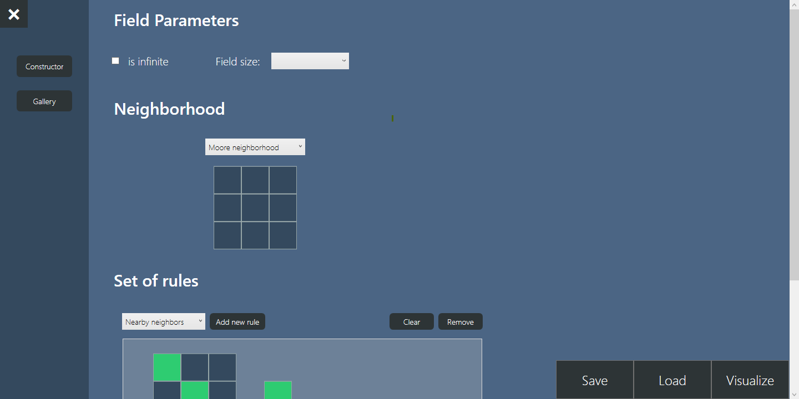
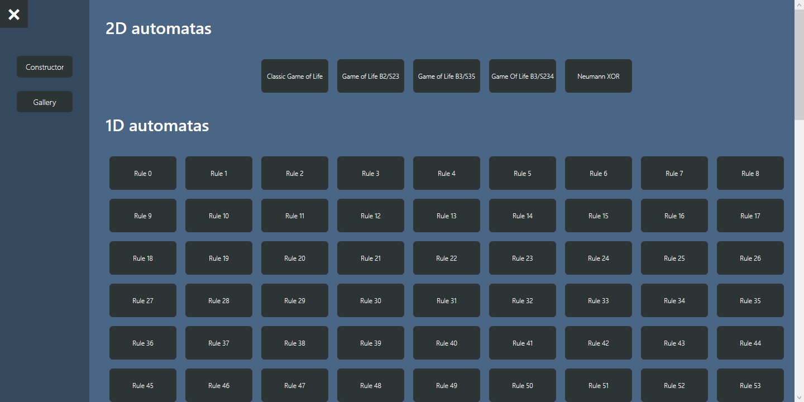

# Cellular Automata Visualizer
> RUS: **Визуализатор клеточных автоматов**

## About
**Cellular Automata Visualizer** is a software that lets you construct custom cellular atomata by providing a neighborhood and a set of rules according to which an automata will evolve. Fully constructed automaton can be then visualized on a specially designed page.

## Functionality
- Automata constructor with 2 types of rules:
    1. **Exact Pattern Rule**
    1. **Nearby Neighbors Rule**
- Ability to save and load constructed automatas via **.json** file
- Automata visualier
- Gallery page with both 1D and 2D automata examples

## Screenshots

## Requirements
1. Windows 7 and higher
1. .NET Framework >v.4.7.2

## Development path
- [ ] Increase perfomance by using either OpenGL or DirectX to visualize an automaton
- [ ] Responsive user interface
- [ ] Save and load file dialog  

---

> **Course Work 2019-20 by Shadi Abdelsalam**  
> _Higher School of Economics, Faculty of Computer Science, Software Engineering Department_
